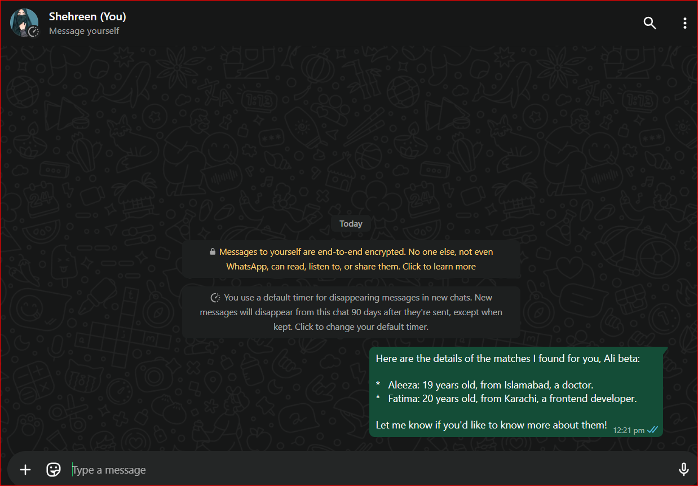

# 💍 Rishty Wali Auntie 🤭  
**AI-powered matchmaking Auntie with real WhatsApp delivery!**

This is a **Rishty Wali Auntie Agent** app — a fun, AI-driven matchmaking assistant built as part of an assignment given by **Sir Hamzah Syed** during the **Friday slot**. 🎓✨

---

## 🔗 Live Demo

👉 [Click here to try the app](https://rishty-wali-auntie-agent.streamlit.app/)  

> 📱 Works best on mobile too!

---

## ✨ Features

- 🤖 **AI Auntie Agent** trained to talk like a typical rishtay wali auntie  
- 📊 **Google Sheet Integration** for live matchmaking data  
- 📱 **WhatsApp Support** – Sends rishtas to your number via UltraMSG API  
- 📬 **Natural Chat UI** using Streamlit  
- 📜 **Interactive chat history**  
- 🌐 **Fully responsive** – works on mobile, tablet & desktop  

---

## 🛠️ Built With

- `Streamlit` – UI and chat interface  
- `AsyncOpenAI` – for chatting with Gemini (via OpenAI interface)  
- `UltraMSG API` – for sending WhatsApp messages  
- `Google Sheets (CSV)` – as your rishta database  
- `Python + asyncio` – for async agent behavior  

---

## 🧪 How It Works

1. User sends a message with **name, age, gender, and number**
2. Auntie reads it and finds **opposite-gender matches** of similar or higher age
3. If you say “send rishta to WhatsApp,” Auntie sends them via UltraMSG
4. All replies stay short, cute, and *auntie-style nosy* 💬

---
  

---

## 🚀 Run the App

```bash
pip install -r requirements.txt
streamlit run app.py
